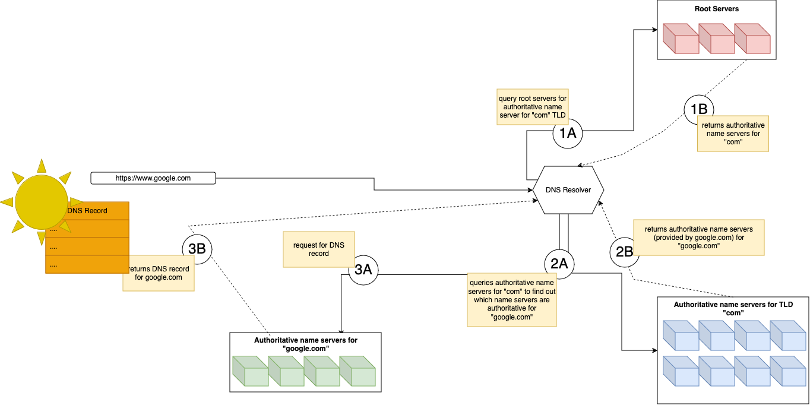

# Deep Dive DNS on Udemy

- DNS (Domain Name System) is aka the phonebook of the internet.  It translate human-readable domain names (such as google.com) into machine readable IP address such as 142.250.183.110 (`nslookup google.com`).
- it has evolved more than just a phonebook though :D

## Main Functions of DNS
- name space
- name resolution
- name registration

## Domain Name Format
It is written from right to left starting with the root ".".  Though the root is omitted in common parlance.

### rules
- each label can be <= 63 characters
- labels can contain on Letters(A-Z, a-z), Digits(0-9) or =Hyphen(-) (LDH rule)
- labels may not start with hyphen `-`.
- top level domain names should not be all numeric
- no maximum limit on the number of sub domains.
- FQDN <= 255 characters including the dots


### parts of a domain name
- Root - is a dot (.)
- Top Level Domain (TLD) - com, in, ca, io, etc.
- Second level domain - the name
- Third level domain - for ex. www, aaa, etc.

### Zone Apex/Naked Domain
- the top and second level domain make up the Zone Apex/Naked Domain - for ex. example.com

### Understanding with example
for a domain like "www.google.com.", it can be said that :
- the www.google.com is a subdomain of google.com
- google.com is a sudomain of .com
- every name after root are called labels
- Root is label of null

### FQDN - Fully Qualified Domain Name
A fully qualified domain name is one that has the root, top-level domain, second level domain and third level domain.  So "www.google.com." is a FQDN

### URL - Uniform Resource Locator
- A URL includes also the 
  - transfer protocol - for ex. https2:// or https:// or http://
  - path - for ex. `/learning` or `/account`, etc.
- example of URL - https://www.example.com/learning

### PQDN - Partially Qualified Domain Name
- these domains don't reach upto the root - for ex. `example`, `localhost` or `subdomain.example` are all subdomains
- these are usually used on local networks for use cases such as testing where the first level domain is not necessary or relevant.

## The DNS Tree
- DNS uses a hierarchical name architecture
- authority is distributed
- name uniqueness is guaranteed

## The Root Server
- When the DNS resolver receives a query, for ex. for www.google.com, it first queries one of the root servers to find out which name servers are authoritative for the .com TLD.
- The root server then responds with the IP addresses of the authoritative name servers for ".com."
- https://root-server.org

user enters google.com in url bar > dns resolver > root servers > authoritative name servers for ".com" > dns resolver > 

## The DNS Resolver fetching the DNS Record


## TLD - Top Level Domains
1. Generic TLD (gTLD) - com, arpa, edu, gov, org, etc
2. Country Code TLD (ccTLD) - in, ca, us, eu, etc.

## Authoritative Name Servers
- Within the DNS Tree, every node has a governing authority name server - thus known as authoritative name server.
- A governing authority can have authority over more than one name server.
- For ex. if I purchased example.com, I have authority over example.com and all sub domains.

# Name Resolution
Once the DNS resolver returns the DNS records which contains the ip address via name servers; its time for our application to connect to that server and get the necessary data.

## Local Name Resolution (`/etc/hosts` resolution)
- typically `/etc/hosts` file takes prcedence over external DNS resolutions.
- the DNS resolver kicks in only if correponding IP is not found in the `/etc/hosts` file.
- we can add entries here - `ip-address` and `domain name`.  This way we can access local server with a domain name.
- Example of 
```txt
192.168.1.43 mycolorprinter.com
192.168.1.1 myrouter.com
```

### `/etc/hosts/`
- wild card entries are not supported
- the file can contain any number of entries
- ip address can be IPv4 or an IPv6 address

### DNS Resolver
- DNS resolver is the middleware that helps to fetch the DNS record associated with the domain name we are looking for.
- `/etc/resolv.conf` on our system displays the DNS resolver used by our computer

#### Iterative resolution
- the DNS resolver sends a request to a server and receives either a referral or an answer.
- if it receives an answer, its stops sending further requests.
- on the other hand, if it receives a referral, it sends a request to the referred name server until it receives an authoritative name server.
- it is the clients responsibility to keep querying servers for the answer.

#### Recursive resolution
- it is the servers responsibility to obtain the DNS information requested by the original client.
- its like calling an agent who; on our behalf, finds the person we need to get in touch with and connects them to us.

## Caching
- `ipconfig /displaydns` - on windows, to get dns cache
- `ipconfig /flushdns` - to clear the cache
- the client as well as DNS resolver may cache resolutions so that the name resolution is more efficient.
- the cache has a Time To Live (TTL) on it to avoid outdated domain name resolutions  

## Reverse Name Resolution (rDNS)
- how about getting the domain name for an ip address?
- if DNS servers are setup based on names and not IP address, how is it possible to get domain name from ip address?
- So, there's a parallel heirarchy based on IP address as well under the `in-addr.arpa.` domain.
- So if; for ex. facebook.com has an IP address of 69.171.250.35; it will be stored in this hierarchy in the DNS tree in this namespace: `35.250.171.69.in-addr.arpa.`.  Though this looks as per how the domain name spaces are arranged (i.e. starting from right); it is not so.  Here, the left most number - 69 - which is first - appears first in the left whereas we would expect it to be 35 since thats the structure of the hierarchy - `69.171.250.35.in-addr.arpa.` is what we would expect in the rtl direction structure.
- we can do reverse look ups for ip addresses with this tool : https://mxtoolbox.com/ReverseLookup.aspx

# Name Registration
This involves the registration of domains. To ensure unique names, name registration has to be processed within a globally distributed framework designed to enforce a certain set of rules.
- ICANN - Internet Corporation for Assigned Names and Number - is at the top of the hierarchy which is responsible for maintaing and managing the framework from root label, TLD label - gTLD and ccTLD, etc.
- below ICANN are 5 regional Internet REGISTRY.  Each registry is responsible for obtaining IP ranges from ICANN in order to allocate them to ISP across specific geographic region
- Next in the hierarchy are REGISTRAR - examples are GoDaddy, NameCheap, BlueHost
- Next are RESELLERS - they are 3rd party companies that offer DNS services through registrars. - examples are Route53
- finally are the REGISTRANT i.e. customers like us who purchase from REGISTRARs or RESELLERS

## Domain Zone File
- When registrant/customer buys a domain name from registrar or reseller the registrar will send all the techincal information to the registry.  The registry will then add our domain zone file to the master service which will tell other services on the internet where our website is located - www.appsparkler.com -> xx.xx.xx.xx

## points to consider when choosing a TLD
- DNSSEC support? a security mechanism - .pro, .travel and .aero are the only ones that don't provide this security mechanism
- IDNs support? - support for non ASCII characters like Arabic, Korean, etc.
- privacy protection? - if privacy is important, we can consider the 
- target audience? - for ex.  .wales, etc.
- relevant field? - for ex. .cafe or .coffee, etc.
- local presence requirements? - for ex. .ca, .in or .us

## points to consider when choosing a Second Level Domain
- use keywords that reflect our industry
- use localised keywords if applicable
- try to keep it short with less than 10 characters
- ensure it is easy to spell
- ensure it is easy to pronounce
- ensure it is easy to remember
- avoid hyphens, numbers or acronyms
- availability and budget
- https://www.dnstwist.it can help us locate impersonating DNS names.

## points to consider when choosing a registrar
- pricing - renewal fee, cost benefits, registration fee, other charges,
- policies - domain transfer, expiration, etc.
- add on services - email hosting, wordpress hosting, email hosting, domain privacy, brokerage service, etc.
- supported TLDs etc.

## EPP (Extensible Provisioning Protocol) codes
- every domain name has atleast one EPP code
- there are two different kind of codes - client codes and server codes
- ex. EPP client codes are clientHold, clientTransferProhibited, clientUpdateProhibited, etc.
- ex. EPP server codes are ok, autoRenewPreriod, serverTransferProhibited
- we can get the EPP codes for a domain on https://lookup.icann.org/en/lookup

# DNS Data Storage
for the servers to provide us with answers or referrals, it does need to store the data somewhere.  That brings us to this chapter of DNS Data Storage

## DNS Zone and Resources
- DNS data is stored in a database that is known as ZONE.  There are two types of ZONE:
  - Forward Lookup - typically used for looking up ip addresses with domain names
  - Reverse Lookup - typically used for looking up domain names with ip addresses
- each ZONE is a collection of Resource Records - known as RRs
- There are many types of RRs in DNS and each one contains a specific set of data
  - for ex. `A record` contains a domain name and is associated with IPv4 address
  - the `AAAA record` (aka quadruple A record) associates the domain name to its IPv6 address.
- All RRs share common format - 
  1. NAME - @, www for a CNAME record, etc. 
  1. TYPE - A, AAAA, CNAME, etc.
  1. CLASS - (IN/CH/HS) - most "IN" in most cases.
  1. TTL - Time To Live
  1. RDLength - size of the resource in bytes
  1. RData - the actual data that the RR stores

## SOA Record
- Start Of Authority record - it indicates the beginning of a zone and should be the first record specified.
- the format - <domain name> <TTL> <INT> SOA <m-name> <r-name>
- <r-name> - signifies the email address of the administrator responsible for the zone.
- within a pair of brackets we have other information (<serial-number> <refresh-interval> <retry-interval> <expire-interval> <minimum>)
- we can use `dig` on Mac or `nslookup` on Windows to find the SOA record.

## NS Record
- one of the most important records
- NS is the Name Server record
- it points to the authoritative name servers for a zone and it is these name servers that hold the actual DNS information for a domain so that the domain can be accessible to internet users
- If these records are missing, the servers wouldn't be able to return an authoritative name server for our domain and users will never be able to get to our zone.
- thus it is important that every ZONE must have at least two NS records of which each one points to a different name server for redundancy.

## A Record & AAAA Record
- These are the `Address Record`
- it needs to be an IP address
- A record is 32 bit whereas AAAA record can have upto 128 bit (4 times that of A record)
- Both may point to the same ip address where dual stack is required.

## PTR Record
- it points IP address to a host name
- it features a reverse domain name (which really is the IP address) and the FQDN of the domain name that the 
- this record particularly helps with rDNS

## CNAME Record
- Canonical Name Record
- it maps one domain name to another
- consists of <alias> <class> <CNAME> <TTL> <canonical-name>
- map subdomains to their apex domains
- uses 
  - redirect multiple TLDs to the same second-level-domain
  - validate ownership or control of a domain
- restrictions
  - CNAME must always point to another domain name and never to an IP address
  - it cannot point to an NS or MX record
  - duplicates are not allowed.

## TXT Record
- This is the Text Record
- it associates textual information with an FQDN
- format is <domain-name> <IN> TXT <TTL> <textual-data>
