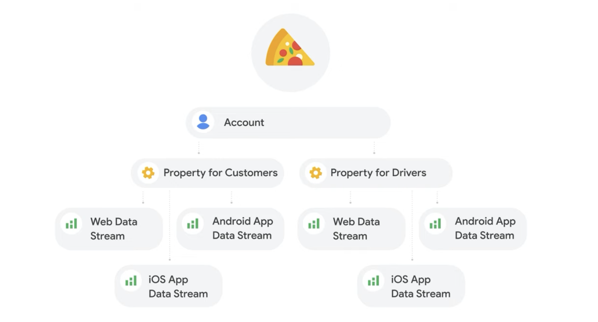

# How, etc...

## How to integrate GA in our app/web-site?

To collect data from our app/website, we need to add a small piece of code to our website/app.
This "small piece of code" is also called a "tag" in the Google Analytics world.

Tags can be added directly to our website or by using a tag management system like GTM (Google Tag Manager)

It is this tag that will connect the information about users like device type, location, interaction, etc.

## Analytics Account Structure
- https://youtu.be/pNfD4jDF8TE?si=3Ru9A8Doj2RYKyQo
- Top level account, nested under accounts are properties and nested under properties are data streams.
- **data-streams** - web will have a web data stream, android and ios too will have separate data streams.
- **best-practice** - setup account structure with one account per company and one property per brand or business unit (for ex. customer and delivery drivers).
- **examples** - 

## Dimensions and Metrics
- **dimensions**: these, usually, are made up of letters.  They answer the questions such as "who", "what", or "where?".  
- **metrics**: these are always made up of numbers. They answer the question "how many?" 
- **Example** - I noticed that 10% weighted average of users visit my app from India.  Here "country" would be the dimension, "India" would be the dimension value. "Weighted average" would be the metric and "10%" would be the metric value.

## Data sent to GA
- **Events** - ex. "Subscribe, Recite, Scroll Gem, Practice Recitation, Contribute"
- Event Parameters - "Gem Number" 
- User Properties - ex. country, device category, etc.
