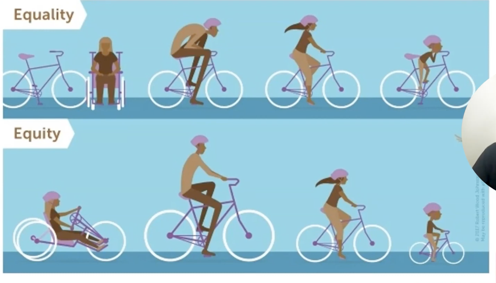

# Accessibility

## Tips
- use `sr-only` class
- use the `Accessibility` tab on 

## Why?
- We have the opportunity to make things accessible
- Think about the visually challenged persona - they are just seeing a blur or complete darkness.  Isn't your offering for this persona as well?
- there are two parts to the equation 
    1. the challenged and 
    1. the one who has to provide for the challenged
- so the question is - is the provider capable or incapable of providing?
- the ability or the disablity is of the provider/environment - since the same person in an accessible environment becomes capable.
> People have impairments, it is the environments/providers inability that make them disabled.


- `compliant !== accessible` 
    - tools will tell us that we are compliant but we may yet not be accessible
    - being compliant is good but being accessible is the key
- compliance breakdown - accessibility is done right at all three stages of the app:
    - design - the wireframes and designs
    - code - the code
    - content - the app content

## How?
- accessibility should be just as much as part of writing an event handler, CSS styles or some logic.  It shouldn't be considered as a "separate" activity.
- Add landmarks
    - Example code
    ```html
        <!--  sr-only class visually hide the element with position absolute and left: -10000px; overflow: hidden;-->
        <main
            aria-labelledby="page-title"
        >
            <h1 id="page-title" className="sr-only">Products</h1>
        </main>
    ```
- Use `role="alert"` to publish any content that needs to be announced
- use `aria-live="assertive"` to jump the queue and announce the contents
- use `aria-labelledby` instead of `aria-label` for translated content.


