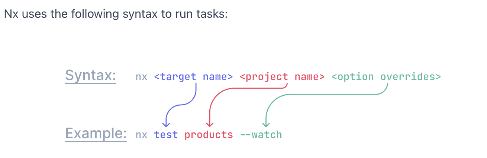

# Nx Monorepo
https://nx.dev/getting-started/tutorials/react-monorepo-tutorial

## creating a workspace: 
```shell
npx create-nx-workspace@latest react-monorepo --preset=react-monorepo
```

## syntax to run any task:
`nx <target-name> <project-name> <option-overrides>`
- for ex. `nx test my-app --watch`


## starting the app:
```sh
npx nx serve <project-name>
```

## Concepts
### Workspace
- for working with NX tools, we need a NX workspace.  We create that with:
```sh
npx create-nx-workspace@latest
```
- This will take us through a series of steps to setup our workspace.

### Presets
- nx has a host of presets to choose from if we don't want to follow the default step-by-step process mentioned above.
- we can also create custom presets to unique needs.
- presets is a special **generator** that is shipped as part of Nx plugin.
To create a simple workspace and select "None" for the `stack`.
```sh
npx create-nx-workspace@latest
```
Within this workspace, we would like to create our custom preset.  As we know, presets are just a special generator with the 

### 
