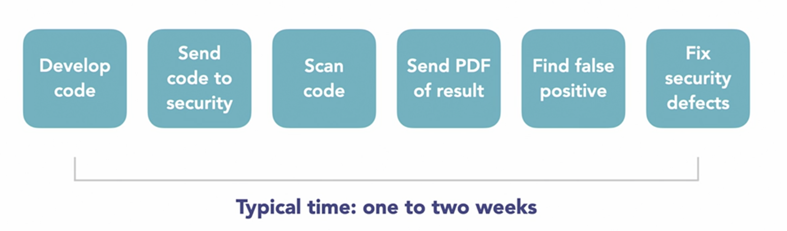
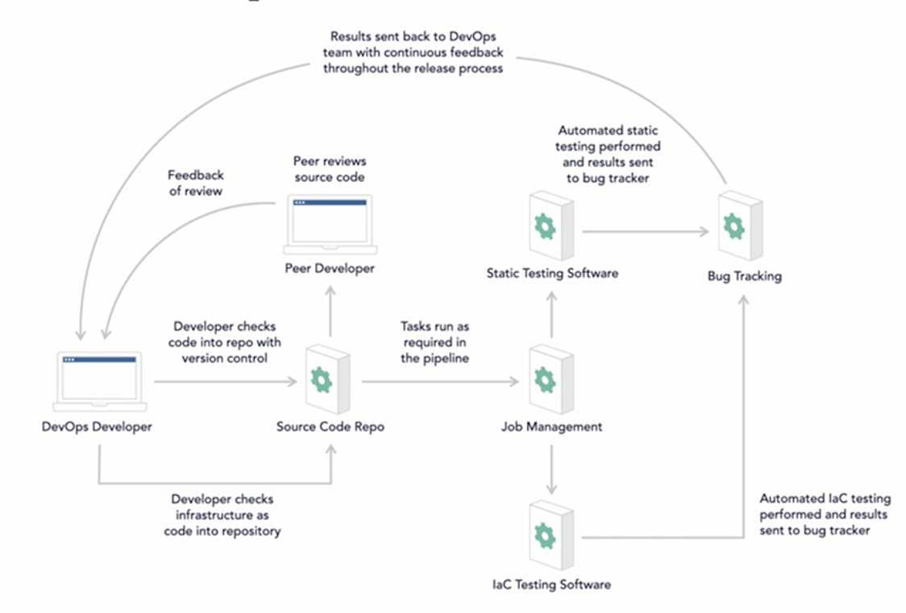

# DevSecOps - Development + Security + Operation - 1 team, 1 goal

## Tools & Resources
- Tools:
    - Find Security Bugs - for Java applications
    - OWASP ZAP (Zed Attack Proxy) - a tool that tries to hack our site and let us know of any security bugs.
    - sqlmap - for finding security bugs in sql db
    - OpenVAS - Open Vulnerability Assessment Scanner
    - recon-ng - for finding tools for DSO
- Resources:
    - DevSecOps - a community resource
    - DecSecOps Reference Design - handbook unclassified by the USA DoD
    - devsecops/awesome-devsecops on Github

## Why?
- DevOps brings the three groups together
    1. Development
    1. Testing
    1. Operations
- Issues with DevOps
    - lack of automation
    - security is not immune to the effect of DevOps
    

## Welcome DevSecOps
- Need to 
    1. Automation 
        - this is the key.  All tools need to be upgraded as everything needs to happen quickly.  Only meaningful results needs to be pushed for developers to consume on the fly.
        - flip the role of security team to auditor
        - real time notification for developers
        - ChapOps, not PDFs - JIRA, Teams, etc.
    1. Education - educate/train developers
    1. Empowerment
        - ensure developers have the tools and resources to fix security issues
        - empower the developer to own the security
- **shifting security to the left** - bring it closer to the development team - the security team needs to provide developers 
    1. the framework
    1. the tools
    1. the expertise
- **dev team and security team are partners.  Dev team is responsible, security team is accountable.**

## Getting started with DSO
- Cloud and DevOps - Cloud is fast, agile and more secure.  To truly capture the value of DevOps and Cloud, you need both.
- APIs are essentials - ex. Burp
- Finding the right toolset. Questions to ask:
    - what languages do we need to support?
    - what technologies do we need to use?
    - what tests do you need to cover?
- Tools
    - SAST - Static App Security Testing - has many false positives
        - commercial - fortify, veracode, checkmarx
        - open source - find sec bugs, brakeman, pmd
    - DAST - Dynamic App Security Testing - they run automated hacks, scans take a long time,
        - commercial - Invicti, Burp, Acunetix
        - open source - ZAP
    - IAST - Interactive Application Security Testing - works using instrumentation, while the app is used.  has low false positives and immediate feedback
        - commercial - contrast, seeker hdiv
        - open source - contrast (limited to one project)
- CI/CD - catch errors sooner
- Containers and DevOps - makes security testing quick and easy, integrates with automation server
- IaC - infrastrucuture as code (IAC) - speed, consistency and makes development more reliable
- SaC - security as code - ex. automate checkes for legal compliance, control gates, automate access control checks.
- application security in DSO - security is integrated, quick and repeatable
- transition
    - sec team needs to have automated builds
    - dev team needs to have automation tool like Jenkins, etc. 
    - task tracking system (JIRA, etc.)
    - reliable unit tests
- continuous improvement and feedback 
   

