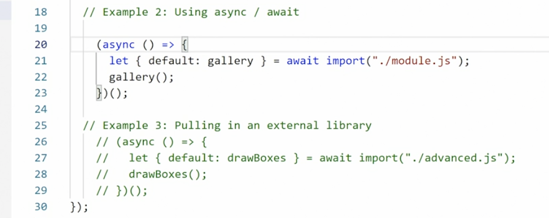
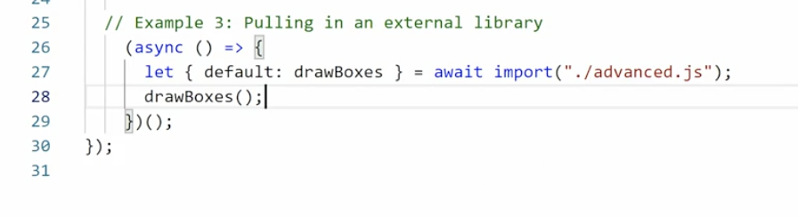
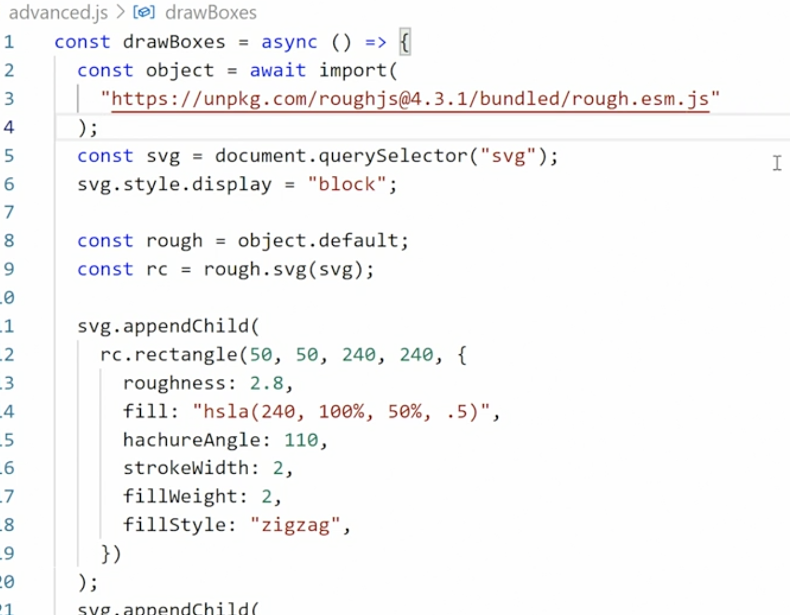
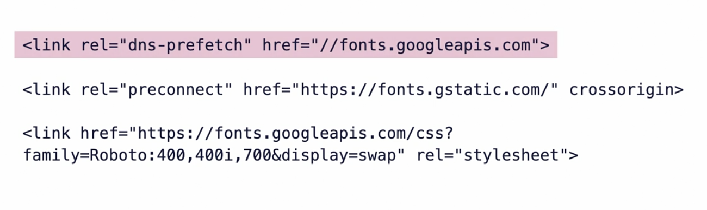

# Performance

Websites should load efficiently and effectively for all users - someone with a fastest speed connection on an ultra HD device as well as someone in a village with extremely poor network and a legacy device.

## Web Developer Tools
- Network Tab - we can reload the page by disabling cache and analyze the waterfall table for resource-loading
- Performance Tab - click on start profiling
- Lighthouse (only for Chrome) - It measures (for mobile as well as desktops) basic metrics like:
    - performance
    - accessibility
    - best practices
    - SEO

## Hosted 3rd Party tools
- Page Speed Insights - This is lighthouse on the web
- WebPage Test
- GT Metrics (actually Lighthouse)

## Performance Metrics
- LCP - Largest contentful paint - before the user sees content - text, images, etc.
- FMP - as the name suggests
- TTI - the amount of time it takes to interact with the app

## How is a webpage rendered
- Device > ISP > DNS > ISP - The DNS provides the IP Address we are trying to connect to
- Once IP Address is available, TCP handshake is established `Browser <> Server`
- Now the request-response occurs between browser and server
- DOM trees and CSSOM trees are setup for HTML and CSS respectively
- For all assets except Javascript, the rendering is not blocked.
- Javascript is render-blocking.  All rendering (DOM and CSSOM, etc.) is blocked and waits for the Javascript to download before the rendering continues
> Javascript is render-blocking.  All rendering (DOM and CSSOM, etc.) is blocked and waits for the Javascript to download before the rendering continues

## HTTP2 and multiplexing
- HTTP1.1 disadvantages - synchronous loading - HTML > CSS > CSS > JS > JS > JS (first HTML, then CSS and then JS files) - one after the another - this is slow and in-efficient.  Browsers cheat by creating multiple connections and downloading multiple files at a time but this causes a lot of strain on the computer.
- HTTP2 
    - browser can download many files at same time over a single connection.
    - server must support HTTP2
    - requires HTTPS encryption - available for free from services like lets-encrypt

## Server Bottlenecks
- processor speed
- available RAM
- storage type
- available bandwidth
- shared resources

- Server/hosting optimizations:
    - get sufficiently powerful hosting
    - explore dynamic cloud options
    - optimize files for server - compression, minification, etc.
    - add CDN to our service
- connection optimizations (fixes for TCP ):
    - pre-connect to servers - DNS prefetch and pre-connect
    - preload content -  
    - consider server push - push files to browser before request is made
    - pre-cache select assets (which we are sure will be used by user)
- file transmit optimization
    - modularize JS and CSS (good for HTTP2)
    - async/defer JS
    - defer non-critical CSS
    - lazy loading images
    - compress all files using GZIP and/or BROTLI
- caching
    - can be done at any of three levels:
        1. on the server
            - vital for server side rendered content from a CMS like WP, Drupal, etc.
            - this way server doesn't have to generate the page for every request.  instead, it returns it from cache
        1. on the CDN
            - these are external caching for assets
            - served from servers closest to the visitor
            - "EDGE COMPUTING" moves dynamic asset building to the CDN for quicker and closer service
        1. in the browser
            - browser caches files automatically
            - can be controlled using http-headers - use short caching for JS and CSS and long caching for main CSSs, main JS, images, fonts, etc. 
            - caching strategies are now often controlled by CDN
            - HTTP2 multiplexing - split CSS and JS into smaller modules
- PRPL pattern - 
    - P - Push/pre-load important resources
    - R - Render the initial routes as soon as possible
    - P - Pre-cache remaining assets
    - L - Lazy Load other routes and non-critical assets

## Performance Budget
- have a budget and adhere to it.
- use webpack (performance option) or Lighthouse (light wallet) to test the budget - Lighthouse has a tool to test the app against the performance budget.
- Example of a performance budget: 

- realistic metrics for performance budget recommended by Google:
    - speed index under 3 seconds
    - TTI - under 5 seconds
    - LCP - under 1 second
    - MPFID - Max potential First Input Delay - is under 130ms
    - max gzip JS bundle size is 170kb
    - total bundle size is under 250kb
    - all this on low-powered "feature" phone on 3G
- dynamic performance metrics - have separate budgets for different scenarios - for ex. slow speed v/s high speed networks
- common performance culprits
    - images, JS bundles and external web fonts - 
**Review the requests on the network-tab** - look for what is taking a longer time:
As we can see in the below image, the TTFB (Time To First Bite) is very high which means that the server is very slow - so that needs to be optimized.


## Optimizing Images
Images makes up for the bulk of the web-page assets wrt size.  Thus we need to optimize images for best performance of websites.  Image quality matters thus we need to be careful while optimizing images that we don't degrade the quality of the images.
- we can use tools like Sqoosh - https://squoosh.app/editor - to optimize image size
- hack - reduce the size to 87% and then increase it back to 115%.  This is known to reduce the image size without the use of any special tool
- image formats
    - JPG/JPEG
        - use for photos when WebP is not an option
        - lossy images with adjustable compression
        - higher compression means larger pixels
        - use JPEG when we have image with complex gradients
    - PNG
        - meant for graphics
        - losslss image format
        - optional transparent alpha layer
        - not recommended for regular photos - JPG/JPEG is more efficient
    - GIF
        - meant for lo-fi graphs
        - lossy image formats
        - only 256 colors
        - can be animated
        - avoid using - use SVG or VIDEO instead
    - SVG (Scalable Vector Graphics)
        - web native graphics format
        - can be used directly in HTML and styled with CSS
        - very small when optimized
        - use for icons, logos, etc.
    - WebP ()
        - meant for web based images
        - recommended for web
        - not supported on older browsers - need to use picuture-element to have a fallback in place
    - **So what should we use??**
        - for photos - use WebP with JPG fallback
        - for complex computer graphics - use PNG or JPEG (whichever is smaller)
        - for graphics with transparency - use PNG or WebP
        - for scalable graphics, icons, graphs, etc. - use SVG
        - avoid GIFs - use Video or animated SVG
- **manual image optimization**
    - determine max image size for all images
    - 1920px should be max (unless the requirements is for more)
    - scale images to max display size
    - experiment with compression in JPEG or WebP, lower is better
    - only enable transparency in WebP and PNG when necessary
    - Simplify SVGs by removing unnecessary points and lines
    - compare file-size for all format and pick the one with the lowest file-size (considering quality is the same)
- Tools to optimize images:
    - `imagemin` NPM Module and its plugins such as `imagemin-mozjpeg`, `imagemin-pngquant`, `imagemin-webp` etc.  
    - sqoosh - https://squoosh.app/editor - online tool to optimize images.  they also have an experimental CLI on NPM
    - sharp NPM module - it is very popular.  It can also change the size for image which can be used for various device sizes.  Though imagemin is better at optimization.  So we can first put the image through sharp and then through imagemin.
- Responsive images
    - use `srcset` attribute of `img` tag. Example
        
        - the `320w, 600w, etc` is for the device width
        - the `size="(min-width: 1200px) 1200px, 100vw"` means if viewport is 1200px or wider, set the image to fit 1200px, else anything less than 1200 (for ex. 590px), make the image full size - 100vw.
    - targeting image size
        - always provide image for smallest screen at 320px
        - make widest image not more than 1920px
        - control the image size with `sizes` attribute
        - find natural breakpoints and make image sizes to match using the tools
        - try to limit yourself to 4-5 image sizes
- Developing for web performance
    - lazy load images - for ex. when the image section is coming closer to view port or user clicks a button, etc.
    - modern browser support lazy loding - to do this we use the `img` attribute `loading="lazy"`.  other option is `"eager"` and `"auto"`
    - `lazysizes` is another NPM tool that helps provides the functionality for lazy loading images.

# markup and content optimization
- optimize build process for codebase
    - JS
        - minify
        - uglify
        - code-splitting
    - CSS
        - minify
        - post process with Post CSS
        - inline critical CSS
        - defer loading of non critical CSS
- bundling v/s modules
    - load only critical assets initially
    - next, load necessary JS for functionality
    - conditionally import ESM modules only when they are needed
- async/defer Javascript files
    - place all JS before the end of the `body tag` for 2 reasons
        - JS is render-blocking
        - JS execution is dependent on elements rendered in the DOM
    - `async` - when we don't want to cause JS file to block-rendering and the the JS doesn't contain any code that needs the entire DOM to available to work 
    - `defer` - when we don't want to cause JS file to block-rendering AND JS execution is dependent on elements to be available in the DOM tree.
    - So, use `async` as default and use `defer` when we need the whole DOM to be available before executing the scripts.
    - So, with this new understanding, we can place the `script tag` in the head of the HTML and add async/defer based on the scenario.
-  use `import` to lazy load JS and functionality
    - Example with async/await:
        
    - Example of async code loading another 3rd party async code (rough):
        
        - then rough.esm is further loaded asynchronously:
        
- optimize JS
    - Minify - removes whitespace, removes comments, makes the entire script one line
    - Uglify - shortens variables and function names, optimize for terseness (the use of few words to say something)
    - minifier tools - uglify-js, terser
- Loading Critical CSS
    - inline any styles impacting the content above the fold in the HTML doc and defer any other CSS
    - tools for this is `critical` NPM module which is a module by Addy Osmani
- deferring non-critical CSS
    - We can use the coverage tab on the amount of un-used CSS and JS
- defer loading with adding link tags just above the related content.  So there will be multiple link tags that will load CSS just before the related HTML elements load
    - for ex.
        ```html
            <link /> 
            <header />
            <link />
            <carousel /> 
        ```
    
## Web Fonts
-intro
    - could significantly affect performance due to many different files for various size, weights, etc.  
    - could cause FOUT, FOIT
- optimizing 3rd party font delivery
    - pick only font-weights that we are going to use in the project
    - combine requests for multiple font families in one
    - use resource hints to dns-prefetch API and preconnect to the font file service
    - Examples:
        
    - `&display=swap` URL parameter for Google fonts - uses available font first and then uses the requested-font when its downloaded- `&text=[your text]` if only a small character set is used - of ex. company name, etc.
    - `rel="dns-prefetch"` - gets the DNS information right away so that when the request is made, it doesn't need to wait for DNS resolution
    - `rel="preconnect"` - opens a connection even before these files are requested - it sort of creates a pipe to connect to the font-repository
    - `crossorigin` - optimizes calls to a different origin


    


    