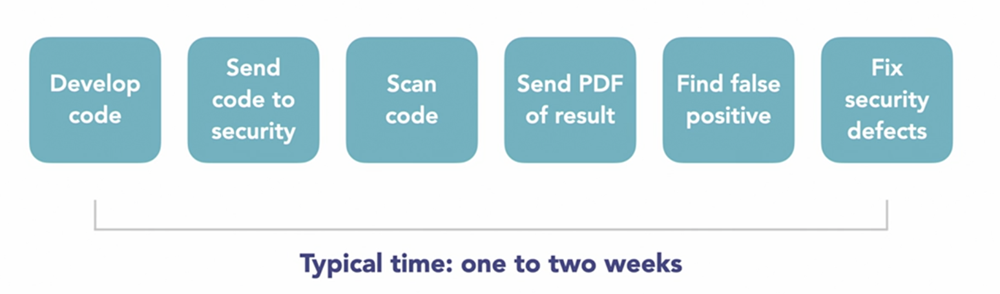

# DevSecOps - Development + Security + Operation - 1 team, 1 goal

## Tools
- Find Security Bugs - for Java applications
- OWASP ZAP (Zed Attack Proxy) - a tool that tries to hack our site and let us know of any security bugs.
- sqlmap - for finding security bugs in sql db
- OpenVAS - 
- recon-ng - for finding tools for DSO
- DevSecOps - a community resource
- DecSecOps Reference Design - handbook unclassified by the USA DoD
- devsecops/awesome-devsecops on Github

## Why?
- DevOps brings the three groups together
    1. Development
    1. Testing
    1. Operations
- Issues with DevOps
    - lack of automation
    - security is not immune to the effect of DevOps
    

## Welcome DevSecOps
- real time notification for developers
- ChapOps, not PDFs - JIRA, Teams, etc.
