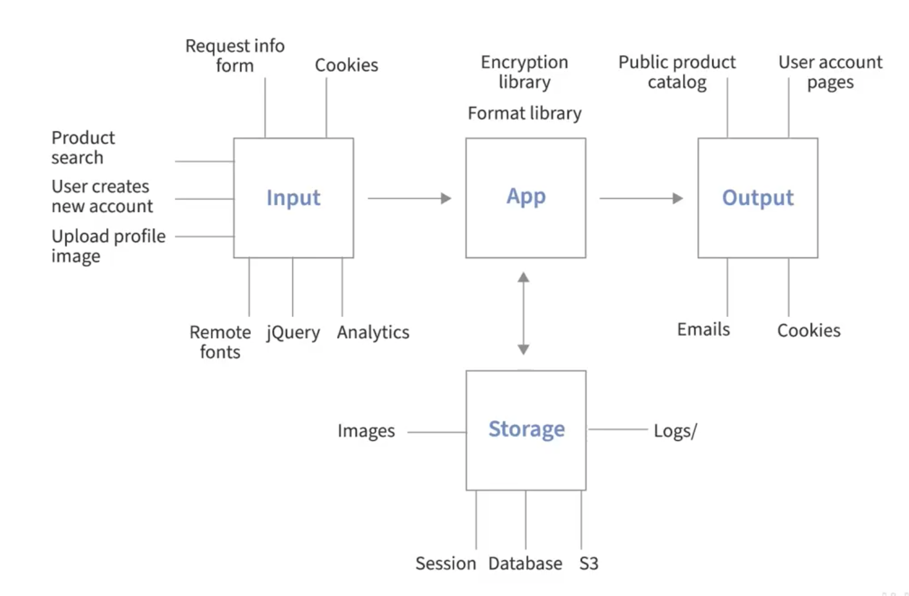

# ⭐️ Web Security Assessment
https://www.linkedin.com/learning/programming-foundations-web-security-22680062/the-importance-of-security

## Resources
- Content Security Policy 
    - https://csp-evaluator.withgoogle.com
    - https://content-security-policy.com

## Security
- Threat Model - think of web security in terms of how a king and queen would protect their castle.  Depending on the current state of affairs, they need to draw up a threat model:
    - profile of an attacker
    - likely attack vectors
    - high value assets
    - vulnerabilities
- 3 goals of data security
    - confidentiality
    - integrity
    - availability

## Profile of an attacker
- hackers can be of two kinds - 
    1. white hat - very skilled security tester
    1. black hat - doing harm
- For an attacker on the web, these are a few kind of black hat hackers:
    type | skill | persistence | goals | about
    -|-|-|-|-
    curious users | no | nope | abc | curious about the internet, etc.
    script kiddies | low | random | feels like pro | uses scripts from the internet and tries to attack
    hacktivists | mixed | very high | their cause, embarass | they try to attack a site that they are activating against
    criminals | mixed | high | thefts, scams | as the name suggest
    tropy hunters | high | medium | bragging rights | for name and fame
    governments | very high | very high | intel, espionage, etc.

## General Security Principle
- least privilage 
    - users ought to be given least privilege to a system - only enough to accomplish the task
    - this principle can be applied to
        - APIs
        - system resources
        - database access
        - software version control
        - public facing webpages
        - code - not all methods and variables need to be exported!
- simple is more secure - write clean code
    - Use clearly named functions and variables
    - Write code comments
    - Prefer built-in functions
    - Remove cruft
    - Disable unused features
    - Break up long sections of code
    - Don't repeat yourself
- never trust users - be vigilant as the one interacting with you might be 
- expect the unexpected - assume you'll be hacked and think like a hacker - try to hack your own application
- defense in depth - have layers of defenses instead of just one layer.
- resilience - has three 
    - identify - monitorings, notifications, etc.
    - respond - let users know, ETAs, etc.
    - recover - survey and prioritize, restore services, assess and improve
- security through obscurity - serialize, encode, mangle code, etc. - be mindful about what information we are broadcasting - for ex. file paths, secrets, etc.
- deny and allow list - add everything to deny-list by default and then add items to allow-list as and when needed
- map exposure points and data passageways - map out how your data is moving in the application and your various

## Filter input, Control output
- regulating request
    - sanitize the http request
        - the request method - check if it is as expected - if we don't the system will execute the same code for any method
        -  request headers - `Content-Type` and `Accept` - ensure the data format coming in as expected
        - ip address - ensure ip address is on allow-list
        - URL - 
        - query parameters - sanitize the query parameters, 
        - `User-Agent` string - could be used to disallow web-crawlers and search engines
        - size - ensure the size (for ex. file size) is within bounds
- validate input - validate the data to ensure it is what we are expecting
- sanitize data - do this before processing the data further
    - encode characters - for ex. encode `>` with `&gt;`, etc.
    - add escape characters
    - sanitize data from our internal systems (ex. database, etc.) as well as data from external sources (for ex. browser)
    - use names to identify condition of data
        - dirty, raw, tainted, unsafe 
        - clean, filtered , sanitized, safe 
        - by default, all new data (either from internal or external sources) should be treated as dirty, raw, tainted or unsafe
- keep code private
- keep credentials private - use environment variables
- keep error messages vague 
    - for ex. use 500 (internal server error) instead of 404 or other speicific error - this will create obscurity which will add another layer of protection
    - ensure logging is removed for production environments
- smart logging (logs)
    - three main activities that need to be logged:
        1. errors - as many details as possible to understand the state of the application 
        1. sensitive actions
        1. suspicious activity

## The Most Common Attack
- credential attacks: Protection from this attack:
    - strong passwords
            - min 12 chars
            - use character variety
            - avoid patterns and dictionary words
            - use a password manager with features
                - strong password generator
                - form autofill
                - note storage
            - popular password managers
                - 1Password
                - LastPass
                - BitWarden
                - Dashlane
    - where available - use SSH keys instead of password - for ex. on GitHub and other domains where available
    - use Yubi Key 
    - use MS or Google authenticators 
    - our architecture
        - protect users - hash their passwords with an encrypting system - Bcrypt aka Blowfish
        - use login throttling - wait time before next-try for 5 wrong attemts, for ex.
- URL Manipulation - an attacker may add parameters that could leak information from our site
    - this is called IDOR - Insecure Direct Object Reference - i.e. access is permitted without auth check
    - protection agains this attack
        - use allow list for acceptable params
        - handle params gracefully and vaguely
        - use access-control for privileged pages and actions
- SQL Injection
    - limit database privleges
    - limit permission to create, drop or truncate tables
    - don't grant access privileges to database users
    - never let the application connect as the root user
    - sanitize input
    - use allow-list to validate data before using it in a query
    - SQL prepared statements - i.e. replacing the parameters in a prepared query with values
- XSS - Cross Site Scripting
    - Reflected
        - most common
        - the attacker adds JS code to be run in a URL or in form-data
        - when the page loads, the script runs immediately in the victims browser
        - for ex. lets say I got a phising email with a linkedin link for me to claim a prize
        - When I click on it, my linked in page will open and execute the malicious script 
    - Stored
        - data from databases, files, cookies, sessions, etc.
        - executes when data is retrieved
    - DOM based
        - data generated by JavaScript
        - runs when user triggers Javascript events
        - to protect, 
            - begin with a map  of data outage points
            -  write validations, use allow-lists, sanitize all data
        - use http-only cookies - this avoids JS from accessing data
            - `Set-Cookie: user_id=24; HttpOnly`
        - define content security policy - 
            - `Content-Security-Plicy: srcipt-src 'self'; `
            - `‹meta http-equiv="Content-Security-Policy" content="script-src 'self'; object-src analytics.com 'self';">`
            - send the policy in the header of HTTP request
            - it can also be in `<head>` tag.
- CSRF - Cross Site Request Forgery - occurs when an attacker tricks the users browser into sending a request to another site
    - example: a user is logged into their bank website
        - now, use visits the forgers website where there is a malicious `` tag with the `src="user-bank.com/transfer/money/10000/to/3849348394"`.  
        - This will be executed on the users browser and the API call could go through.
    - another example is of a POST request made inside an iFrame that loads when user visits the forged website.  The iFrame contains a form which submits on-load and fires a POST requests as crafted by the attacker
    - protection
        - use GET only for retreiving and not for changes
        - use POST for making changes
        - embed csrf-token in a hidden input field
- cookie visibility and theft - 
    - avoid adding sensitive information in the cookie
    - best place for sensitive data is in files or db on the server side.
        - a reference identifier/session-id is stored on the client side in the browsers cookie. this way sensitive data stays on the server.
        - the session-id is still visible and we need to protect it too
        - use HttpOnly cookie - `Set-Cookie: user_id=99; HttpOnly`
        - setup SSL and use https://
        - give expiration date to cookies
        - consider domain, sub-domain and path that will use the cookie
        - by default cookies are accessible throughout the domain - on all sub-domains and paths.
        - serialize the cookie data for security and obscurity
- Session Hijacking
    - add "expires" on sessions
    - validate input, sanitize output, content security policies, cookie-setting - httpOnly, secure, expire
    - use https
    - mark the session cookie to Secure
    - expire and remove old sessions
    - destroy the session when user logs out
    - regenerate session id after re-login
    - comparing user-agent strings or ip address is not recommended though it is quite popular.  the above methods provide more security.
- Session Fixation - in this type, the session-id is provided by the attacker.  Once the user logs in, the attacker gains access to users account.
    - machine in the middle attack
    - protection
        - never accept session-id in GET or POST requests
        - only accept them in secure cookies
        - other protection are similar to session hijacking protection
- Remote Code Execution (RCE) 
    - avoid using system execution functions
    - disable functions
    - do not use dynamic data
    - validate data, use allow list, 
    - sanitize data
- file upload abuse
    - too many, too large or too frequent
    - protection
        - require user to login before they can upload files
        - don't allow anonymous uploads
        - don't make user uploaded files available for public download
        - validate size, file type, file-name, mime-type, etc.
        - scan servers for malware
- Denial of Service attack - DoS- prevents legitimate users from using a service they have priviliges to.
    - use flooding or crashing to make service unavailable
    - protection - 
        - first check if DoS is in our threat model
        - if it is, use 3rd party service to secure our data from attacks
        - Azure, Cloudfare, Project Shield, etc.
        - filtering - applies certain rules to incoming traffic - not all requests are let through.
        - throttling - regulating the flow to keep it below the maximum level. aka rate-limiting
        - sinkholing - traffic is re-routed to a new destination - usually a server that can capture and alayze the traffic
        - blackholing - traffic return null or nothing
        - 

    

