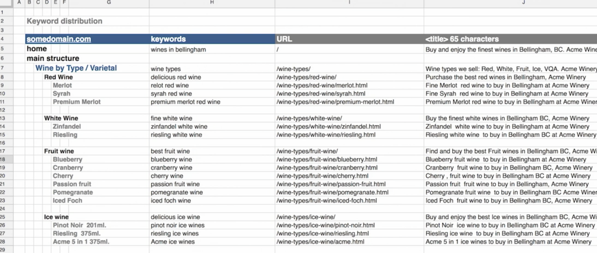
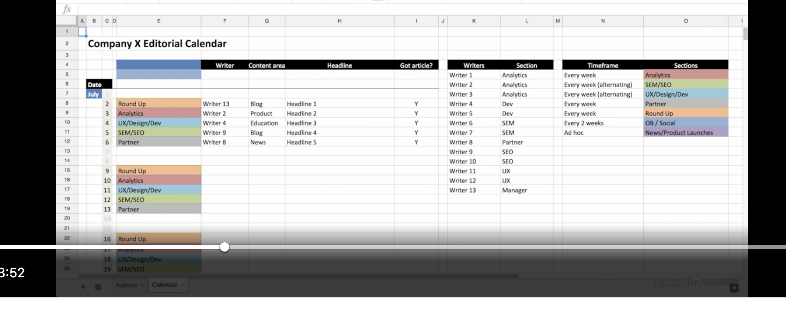

# SEO Optimization

## Links & Resources
- Google Trends
- Google Structured Data Testing Tool - https://developers.google.com/search/docs/appearance/structured-data
    - https://schema.org
- Moz
- https://answerthepublic.com
- Google Search Central - https://developers.google.com/search
- Site Maps - https://sitemaps.org - to create sitemaps for our website
- robotstxt.org - for adding a `robots.txt` file
- Google Search Console
- Bing Search Console
- https://schema.org - microformats - helps SEs easily recognize content. JSON-LD is the preferred method by Google and Bing.

## SEO Terms
- SERPs - Search Engine Results Pages
- keywords -  

## Keyword Research Plan
- Put yourself in the shoes of your customers - if you were a client for your own website/idea, what would you search for on Google to get to your website?
- Google Trends and https://answerthepublic.com are two websites that will help us the value of our keywords.
- Long Tail Keywords - descriptive keywords used in less common variations.  For ex. case is extremely competetive, "iphone cases" too is very competetive, "protective blue iPhone cases" - this is a long tail (more descriptive keyword) and is less competetive.
- https://moz.com also has a great tool for keyword research
- **Relevance** - ensure the keyword is relevant
- **Search Volume** - ensure the keyword has a significant volume (unless you're targeting a very specific group). There are various tools for this:
    - Moz Keyword Explorer
    - WordStream
    - Ahrefs Keyword Explorer
    - SEMRush Keyword Magic Tool
    - Google Trends
    - Google Keyword Plan (on your Google Ads account)
- **Keyword Competetion** - aka "Keyword difficulty" - expensive keywords due to many bidders.
- **Ongoing Keyword Evaluation** - keep reviewing our keywords to check if they are scoring well on ROI or not.  Use paid search from Google or Bing to see the performance of our keywords.

## Keyword Distribution
Every page in a website has different content.  Thus it is important to perform a keyword distribution - i.e. align page content with target keywords
- organise mapping to keywords
- track keywords that still need pages
- use a spreadsheet tool to organize the data
- the columns would be something like this:
    - URL of the page
    - `<title>` tag
    - number of characters in title (65 is the general target)
    - `<meta-description>` tag
    - number of characters in meta-description (156 is the general target)
    - `<h1>` header


## Content Optimization (Human Aspects)
- **Quality Content** - content needs to be clear and of good quality - both people and search engines look for this.  Just like, we would bin a page that doesn't give us information we need, search engines don't index pages that are not of good quality.
- **Clean Site Structure and elements** - always have a clean and clear site structure which will help SEs easily understand it.
    - URL should contain usable information about the page itself - for ex. https://letsrecite.app/the-essence-of-the-bhagavad-gita/chapter-02-verse-47
    - use `-` instead of spaces or underscores
    - Page title needs to be clear - for ex. `<title>Chapter 2, Verse 47 - Lets Recite App<title>`
    - Add a `meta-description` tag - `<meta name="description" content="Easily recite The Essence Of The Bhagavad Gita - " />`
    - Add a single descriptive `h1` tag - `<h1>Lets Recite The Essence of The Bhagavad Gita</h1>`
    - Keep tweaking the `title and meta description, h1 etc.` to see difference in performance 
    - Content needs to be optimized for people first and SEs later because SEs also are trying to emulate human behavior so if you're able to attract humans, SE will follow the trail
- **Optimizing non-text components of webpage** - 
    - add `alt` attribute to images, properly describing the image.
    - also, the image file name can be descriptive - for ex ``.
    - we can also use image-captions
    - for links, we can use a `title` attribute
    - Structured Data - use Google's Structured Data
    - Also, look at https://schema.org/imageObject to 

## Content Optimization (Technical Aspects)
SE doesn't see the same webpage that we see.  They see the code (HTML).
- **Clean Compatible Code** - we need to ensure that our code is clean and free from bugs of any sort.
- **Sitemap & Links** - SEs click on every link on the HTML.  
    - create a HTML site map for our website.
    - create a XML site map - easier for SEs and these can be submitted directly to the SE
    - add a `robots.txt` file to control how easily SEs crawl our site 
    - add `<meta name="robots" content="noindex" />` to ensure pages are never returned in search results and don't block the page in `robots.txt` else the page will never be found
    - visit robotstxt.org for how to configure the robots
- **Canonical URLs and redirects** - 
    - **Canonical URLs**: we need to tell the SE to index the correct page especially for pages that turn up the same content for different URLs.  For ex
        - http://somedomain.com/index.php?id=200
        - http://somedomain.com/index.php?id=200&code=82823
        - http://somedomain.com/index.php?id=200&code=828211&country=in
        - though all 3 URL have the same URL, their parameters are different and they could render different content confusing the SE and users.
        - thus, we need to inform the SE to index "http://somedomain.com/index.php?id=200" as the canonical URL - i.e. no matter what URL is in the address bar, we need to index the one mentioned as the primary URL.  This is the tag that will help us do that:
            - ```html
                <link rel="canonical" href="http://somedomain.com/index.php?id=200%27" />
                ```
        - We can also specifiy the effect URL parameters will have on the Google or Bing Search Console
    - **Redirect URLs** - use redirect rules for webpages when content has moved
        - 301 - Permanent Redirect - use this when the page has moved permenantly
        - 302 - Temporary Redirect - use this when the page has moved temporarily - should be used only for short term
        - avoid other techs such as:
        -    ```html
                <script > window.location.href =
                "https://www.example.com"; </script>
            ```
        - or
        - ```html
                <meta http-equiv="refresh" content="0;url=http://www.example.com/"
                />
            ```
- Using **microformats** - we may have parts of a webpage that may have very specific types of content - for ex. product reviews, embedded video, food recipe, etc.  We can help search engines recognize the content by providing information.  https://schema.org 
- improving server-side factors:
    - use caching for improved performance
    - use https instead of http
    - ensure server reliability - use server monitoring services to ensure your server is up and running.

## Using Goolge Search Console
- we can learn this as a separate module

## Long Term Content Strategy (Content is king)
1. Plan 
    - who is the target audience
    - what is their need
    - where they hangout and converse online
    - coupled with excellent keyword research, it makes up for good plan.
    - **clearly define the goals and objectives** - they should tie back to your bottom line (business objective)
    - **clearly define market personas** - this will help us understand our target audiences and their needs
    - **get more POVs** - involve everyone in our org
    - **define content policies** - ensure the appropriate content is posted by all users of the app as once its on the internet, it could be there forever (almost).
    - **monitor trends and stay relevant** - ensure content and keyword research is up to date and relevant (E role)
2. Create (& Manage)
    - quality is more important than quantity
    - ensure users find what they are looking for on your page.
    - **understand different types of content** - text, audio, video, images, PDF, word docs, PPTs, other file formats, infographics, etc.
    - **metadata** - ensure all meta data is updated for the videos, images, etc. For ex. if we upload a video on YT, ensure all metadata is filled in.
    - **ideas for content**
        - list broad content themes - for ex. educational, self-help, science, art, statistical, etc.
        - find out what similar solutions are offerring and what is your 
        - get feedback from customers and partners
    - **use an editorial calendar**
        - it maps out content development process
        - it has a timetable of who will update content, etc.
        - example: 
        - plan and follow the schedule rigourously.
    - **using social media** - add buttons only for social media your app presence is active on.
        - build your social media presence
        - use social share buttons
        - use hash-tags and innovate hash-tags unique to your app
        - have a strategy
            - which networks will it go out on?
            - what will the message say?
            - which hash tags will it it use?
            - who will do it?
            - who will monitor and respond to the activity?
    - **measure content performance** - 
        - what pieces of content are our visitors looking at?
        - whats the most popular content?
        - are visitors sharing our content?
        - are visitors engaged with our content?
        - is our content generating quality business results?
        - using GA to find out, for ex:
            - pages per visit
            - avg. time on site
            - bounce rate
        
3. Manage
    - a sound CMS helps a great deal

## Link building strategies
- SE crawlers look out for links pointing to other pages
- SE give more weightage to links on sites that have authority, reputation and trust worthy
- 3 important stats:
    - the number of links, 
    - the ratio of links to linking domain and 
    - the quality of those links - relevance, 
- increase link popularity
- always define your links - for ex. `<a>Learn to recite</a>` is better than `<a>Click here </a>` to learn to recite

## Test your site
- Visit Google and search for you brand - is it returning the image you expected?


