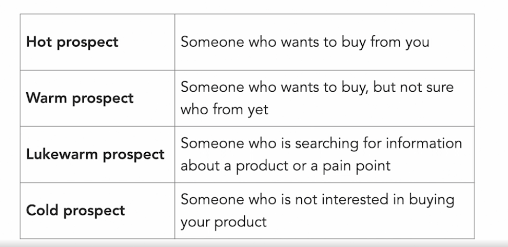

# SEO: Ecommerce Strategies

## Tools and Resources
- https://backlinko.com/hub/seo/architecture - article about SEO website structure 
- Broken Links checker - https://ahrefs.com/broken-link-checker
- keyword research - https://answerthepublic.com

## Website structure
- It is a very important factor.  During planning stage itself, we need to create a robust website structure.
- Links
    - interlinking - pages on our website can have links to other pages
    - backlinking - links on other websites to our website
    - social media links - link on social media to our website
    - ensure that page exists, is relevant 
- Crawl Budget
    - this can be reviewed on Google Search Console > Legacy Tools > Crawl Stats
    - https://backlinko.com/hub/seo/architecture
    - avoid more than 4 levels to our site
    - pages closer to the root page have more authority
- improve crawl budget
    - increase website speed
    - get rid of unnecessary pages
    - fix pages that have issues
    - sending social signs to our website
    - update our website often
- navigation considerations - issues with navigation
    - duplicate content
    - faceted navigation - i.e. multiple URLs to land on the same page
    - use breadcrumbs - 

## URLs of e-commerce
- https instead of http
    - buy, activate and install the certificate
    - ⭐️ add target key words in the URL 
    - add categories in URL - for ex. https://letsrecite.app/learn-to-recite/the-essence-of-the-bhagavad-gita/chapter-02/verse-47 instead of https://letsrecite.app/3asdf82asdfasdf42/23asdf42-2sadf3asdf42asdf4
- sub-directories are preferred to sub-domains unless you have a separate concept, niche or product in which case sub domains are a good option.
- descriptive anchor text instead of "click here" 
- managing broken and redirect links - Google Search Console -  
refs.com/broken-link-checkers

## Optimizing product pages for SEO
- think deeply about what someone will type for your specific offering.  use those keywords for each page.
- be intentional and create your pages with meaning and depth to attract real users - your users will only be as real as your content.
- Buyer journeys and keywords
    - Focus on keywords that:
        - have clear intent
        - seek information about your offering
        - suggest searches may benefit from our product at some stage
- Search intent can be one of four types:
    
    - create content for users with all intents
- create a brand
    - being active on Social Media with your offering
    - working with blogs and influencers
    - run PR campaigns
- 
